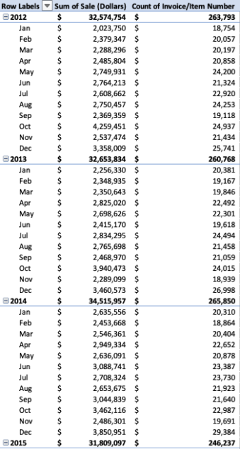

# Steps to reduce initial data file to a workable sample (see LiquorSalesSample1.csv)
#### These cleaning steps were performed during the Project Proposal phase of our project (part 1)
1. Original Liquor_Sales.csv file had nearly 20 million rows

2. We created a sample of the data by reducing the number of rows to the max allowable in Excel (1,048,576 rows including the header). We did this by allowing Excel to make the selections when the csv file was opened. The data spread is listed below. As a team, we decided that the spread was a good representaition of our data as a whole. 
<figure width=100%>
</figure>
 
3. We further reduced our data file by removing attributes that we deemed unneccessary or redundant. The following attributes were deleted from our sample file. By removing these attributes and zipping our data file, we were able to upload the file to GitHub for team use.
* Address - we have city and zipcode in our data so address was deemed redundant
* Store location - this attribute has the geo location and is unneccessary
* County number - we have city and zipcode in our data so county number was deemed redundant
* Category - we have the category name so the category number is redundant

# Steps to further reduce data sample (see LiquorSalesSamplev2.csv.zip)
#### These cleaning steps were performed to further reduce our sample data to the attributes necessary to answer our questions (from proposal slide deck)
1. Added a reference number to column A so that we would be able to sort the data as desired without losing the original order (numbered rows in ascending order)

2. Removed all rows for years 2016-2018. We chose to only include data for 2012-2015 because our sample included transactions for all months except for December 2015. The data for 2016-2018 was pretty sparse. This reduced our sample from 1,048,576 rows to 1,036,649 rows including the header.

3. Removed attributes that we considered unneccesary to answer the questions we proposed in part 1 of our project. 
* Store Number
* Store Name
* Vendor Number
* Vendor Name
* Item Number
* State Bottle Cost 
* State Bottle Retail
* Volume Sold (Gallons) 

After the reduction, we were left with:
* Reference Number
* Invoice/Item Number
* Date
* City
* ZipCode
* County
* Category Name
* Item Description
* Pack
* Bottle Volume (ml)
* Bottles Sold
* Sale (Dollars)
* Volume Sold (liers)

4. We decided to delete all rows with null values in any attribute as these rows made up minimal percentage of total transactions (about 0.15%). Here is the breakdown of null values as a percentage of total rows.
* County - 0.10% (1,038 rows)
* Category Name - 0.05% (490 rows)
* Sale (Dollars - 0.0004% (4 rows)

Our data sample was reduced from 1,036,649 rows to 1,035,117

5. Removed 375 transactions with $0 in sales
Our data sample was reduced from 1,035,117 to 1,034,741

6. Added a labels column that categorizes each liquor. We ended up with 15 unique labels.
* Bourbon
* Brandy
* Cream Based Liqueur
* Gin
* High Proof Beer
* Liqueur
* Novelty
* Other Grain Alcohol
* Pre-Mixed Cocktails
* Rum
* Schnapps
* Scotch
* Tequila
* Vodka
* Whiskey

7. Split Invoice/Item Number attribute and determine if there are multiple items per invoice. If so, we will use this to determine what items are typically purchased together.

The item number appears to be the last 3 digits of the concatenated Invoice/Item Number field. I pulled the left 3 characters and the right 9 characters to split the field.

There are 148,431 invoice numbers that have more than 2 line items.

Removed lines that have 1 line item in the invoice. Our data sample was reduced from 1,034,741 from 1,004,380.

